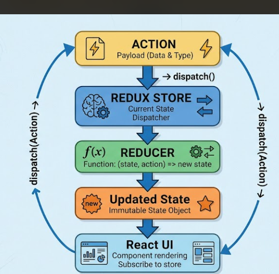

<!-- Redux is a state management library. npm install @reduxjs/toolkit react-redux -->

#### Customer

↓

### Order (Action)

↓

### Waiter

↓

### Kitchen (Reducer)

↓

### Food Prepared (New State)

↓

### Customer receives food (UI Updates) 

               ACTION

                  ↓

          REDUX STORE

                  ↓

              REDUCER

                  ↓

           Updated State

                  ↓

             React UI
*** withOut Redux ***

every components passes props
### passing props called Prop Drilling ###

### {
       *** to many props ***
       *** hard to maintain ***
       ***difficult to debug ***
       *** every components become dependent *** 
       *** so with redux we could directly access the data of the components ***
### } 

/***What is Redux?
Why Redux?
Store
Slice
State
useSelector
useDispatch
Provider
Login using Redux
Auto Authentication with localStorage
Logout***/

### Store ###
===== central storage ======

### Slice ###

==== small part of store ====
<!-- EXAMPLE -->
Store

├── auth
├── cart
├── theme
└── products

### State ###

==== current data ====

*** {
  isAuthenticated: false,
  user: null
} ***
### after login ###

***{
  isAuthenticated: true,
  user: {
    name: "Admin",
    email: "admin@gmail.com"
  }
} ***

==== here redux update the state if something changes ====

### provider ### 
===The provider makes the redux store available to the entire react application===
 
###                              Provider                       useSelector(is used to read data from the Redux Store.)

                                    ↓

###                              React App                      useDispatch(is used to update the Redux Store.)

                                    ↓

###                            All Components                   Redux data is stored in memory. so we use localstorage

